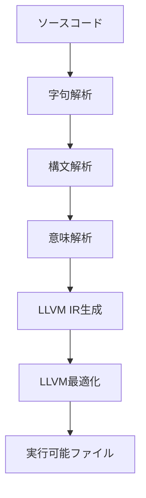

# SimpleGo 言語仕様

## 1. 概要
PoorGoは、Goの基本的な機能を実装したサブセット言語。LLVM IRを生成し、LLVMツールチェーンを使用してネイティブコードにコンパイルすることを想定している。

### 設計目標
- Poorで理解しやすい実装
- LLVMを活用した効率的なコード生成
- 教育目的に適した機能セット

## 2. 文法仕様

### 2.1 プログラム構造
```go
// すべてのプログラムは以下の形式に従う
package main

func main() {
    // プログラムのエントリーポイント
}
```

### 2.2 基本型
```go
int     // 32ビット整数
string  // 文字列
bool    // 真偽値
```

### 2.3 変数宣言
```go
// 暗黙的な型推論
x := 42
name := "hello"
flag := true

// 明示的な型宣言
var x int = 42
var name string = "hello"
var flag bool = true
```

### 2.4 関数定義
```go
// 基本的な関数
func add(x int, y int) int {
    return x + y
}

// 戻り値なしの関数
func printValue(x int) {
    print(x)
}
```

### 2.5 制御構造
```go
// if文
if x > 0 {
    // positive
} else if x < 0 {
    // negative
} else {
    // zero
}

// forループ
for i := 0; i < 10; i++ {
    // カウンタループ
}

for condition {
    // whileループ相当
}

for {
    // 無限ループ
}
```

### 2.6 演算子
```go
// 算術演算子
+    // 加算
-    // 減算
*    // 乗算
/    // 除算

// 比較演算子
==   // 等価
!=   // 不等価
<    // 未満
>    // より大きい
<=   // 以下
>=   // 以上

// 論理演算子
&&   // 論理AND
||   // 論理OR
!    // 論理NOT
```

## 3. コンパイラ実装

### 3.1 コンパイルパイプライン


### 3.2 コンパイラコンポーネント
1. **Lexer**
   - トークンの生成
   - ソース位置の追跡
   - 基本的なエラー検出

2. **Parser**
   - ASTの構築
   - 文法検証
   - 構文エラーの報告

3. **Semantic Analyzer**
   - 型チェック
   - シンボル解決
   - 意味的制約の検証

4. **Code Generator**
   - LLVM IR生成
   - ランタイム関数の連携
   - 最適化オプションの設定

### 3.3 組み込み関数
```go
print(value)      // 値を標準出力に出力
len(value)        // 文字列の長さを取得
error(message)    // エラーを生成
```

## 4. 実行時機能

### 4.1 メモリ管理
- スタック割り当て優先
- LLVM組み込みのメモリ管理を使用

### 4.2 エラー処理
- コンパイル時エラーの検出
- 実行時エラーのパニック機構

## 5. コマンドライン操作

### 5.1 コンパイルコマンド
```bash
# 基本的なコンパイル
$ pogo source.pg

# 出力ファイル指定
$ pogo -o program source.pg

# LLVM IR出力
$ pogo --emit-llvm source.pg

# 最適化レベル指定
$ pogo -O2 source.pg
```

### 5.2 オプション
```
-o <file>      出力ファイル名指定
-O<level>      最適化レベル (0-3)
--emit-llvm    LLVM IRを出力
-v, --verbose  詳細出力
```

## 6. 制限事項
- クラス/オブジェクト指向機能なし
- ジェネリクスなし
- 並行処理（goroutine/チャネル）なし
- ポインタなし
- スライス/配列なし
- マップなし
- 構造体なし
- インターフェース（errorを除く）なし
- パッケージ（mainパッケージのみ）

## 7. 例：完全なプログラム
```go
package main

func fibonacci(n int) int {
    if n <= 1 {
        return n
    }
    return fibonacci(n-1) + fibonacci(n-2)
}

func main() {
    result := fibonacci(10)
    print(result)
}
```

## 8. エラーメッセージ形式
```
[Phase] Error at line <line>, column <column>: <message>

例：
[Lexer] Error at line 1, column 5: Invalid character '#'
[Parser] Error at line 3, column 10: Expected '{' after function declaration
[Semantic] Error at line 5, column 15: Undefined variable 'x'
[CodeGen] Error: Failed to generate LLVM IR
```
