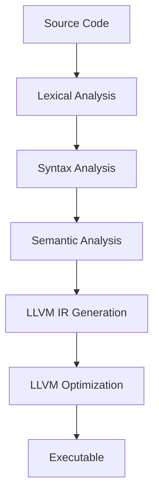

# PoorGo Language Design Document

## 1. Overview
PoorGo is a subset implementation of Go that generates LLVM IR and compiles to native code using the LLVM toolchain.

### Design Goals
- Poor and understandable implementation
- Efficient code generation using LLVM
- Suitable feature set for educational purposes

## 2. Language Syntax

### 2.1 Program Structure
```go
// All programs must follow this format
package main

func main() {
    // Program entry point
}
```

### 2.2 Basic Types
```go
int     // 32-bit integer
string  // String
bool    // Boolean
```

### 2.3 Variable Declarations
```go
// Type inference
x := 42
name := "hello"
flag := true

// Explicit type declaration
var x int = 42
var name string = "hello"
var flag bool = true
```

### 2.4 Function Definitions
```go
// Basic function
func add(x int, y int) int {
    return x + y
}

// Function without return value
func printValue(x int) {
    print(x)
}
```

### 2.5 Control Structures
```go
// If statement
if x > 0 {
    // positive
} else if x < 0 {
    // negative
} else {
    // zero
}

// For loops
for i := 0; i < 10; i++ {
    // Counter loop
}

for condition {
    // While loop equivalent
}

for {
    // Infinite loop
}
```

### 2.6 Operators
```go
// Arithmetic operators
+    // Addition
-    // Subtraction
*    // Multiplication
/    // Division

// Comparison operators
==   // Equal to
!=   // Not equal to
<    // Less than
>    // Greater than
<=   // Less than or equal to
>=   // Greater than or equal to

// Logical operators
&&   // Logical AND
||   // Logical OR
!    // Logical NOT
```

## 3. Compiler Implementation

### 3.1 Compilation Pipeline


### 3.2 Compiler Components
1. **Lexer**
   - Token generation
   - Source position tracking
   - Basic error detection

2. **Parser**
   - AST construction
   - Grammar validation
   - Syntax error reporting

3. **Semantic Analyzer**
   - Type checking
   - Symbol resolution
   - Semantic constraint validation

4. **Code Generator**
   - LLVM IR generation
   - Runtime function integration
   - Optimization settings

### 3.3 Built-in Functions
```go
print(value)      // Output value to stdout
len(value)        // Get string length
error(message)    // Create an error
```

## 4. Runtime Features

### 4.1 Memory Management
- Stack allocation preferred
- Using LLVM built-in memory management

### 4.2 Error Handling
- Compile-time error detection
- Runtime panic mechanism

## 5. Development Phases

### Phase 1: Basic Structure
- Package declaration
- Main function
- Print statement
- Basic LLVM IR generation

### Phase 2: Core Features
- Variable declarations
- Basic expressions
- Control structures
- Function definitions

### Phase 3: Type System
- Type checking
- Type inference
- Built-in types
- Error types

### Phase 4: Optimizations
- LLVM optimization passes
- Debug information
- Error recovery

## 6. Error Message Format
```
[Phase] Error at line <line>, column <column>: <message>

Examples:
[Lexer] Error at line 1, column 5: Invalid character '#'
[Parser] Error at line 3, column 10: Expected '{' after function declaration
[Semantic] Error at line 5, column 15: Undefined variable 'x'
[CodeGen] Error: Failed to generate LLVM IR
```
